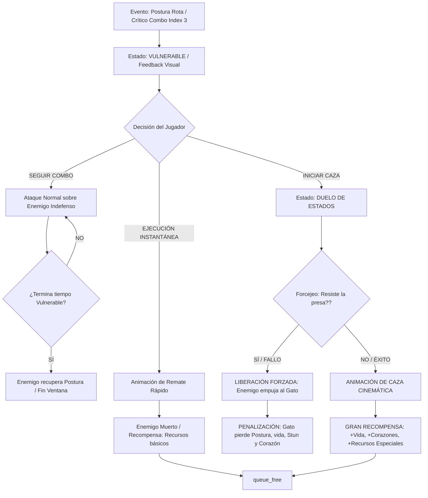
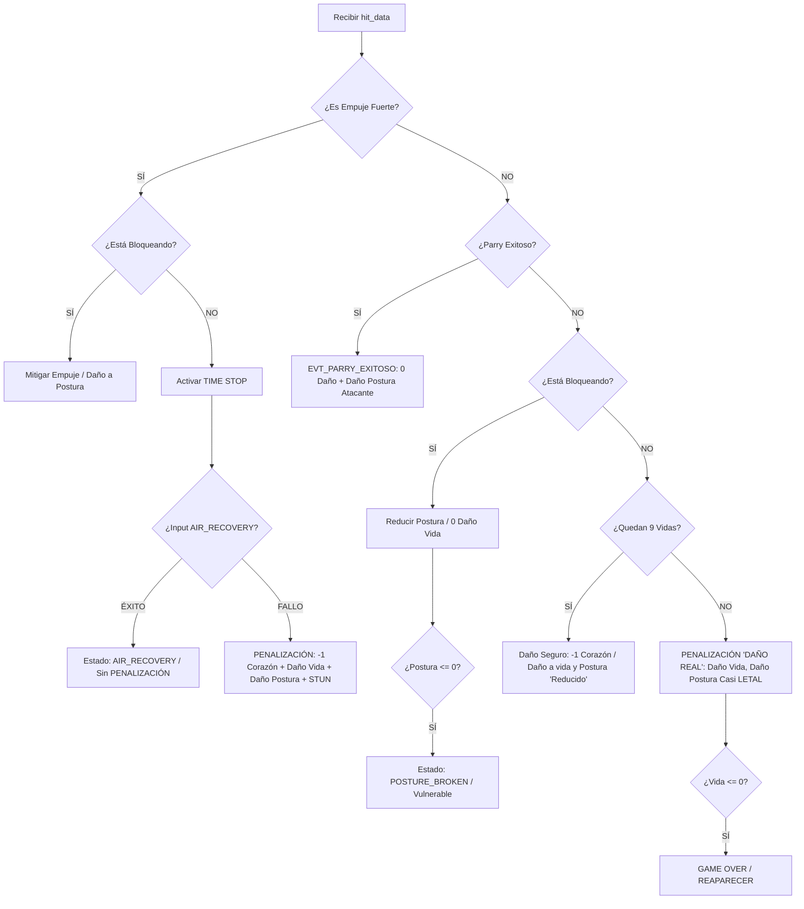
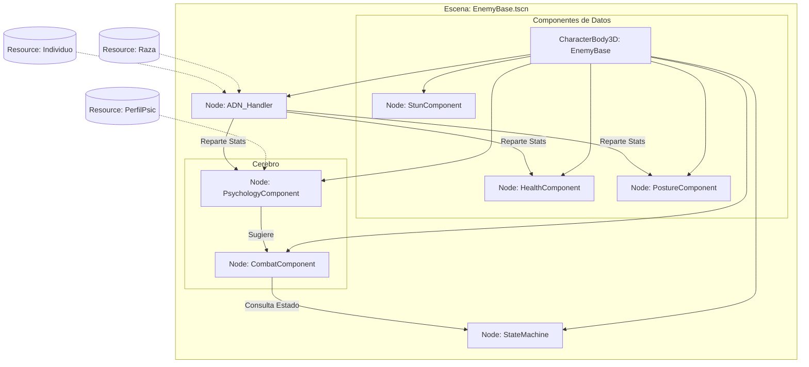
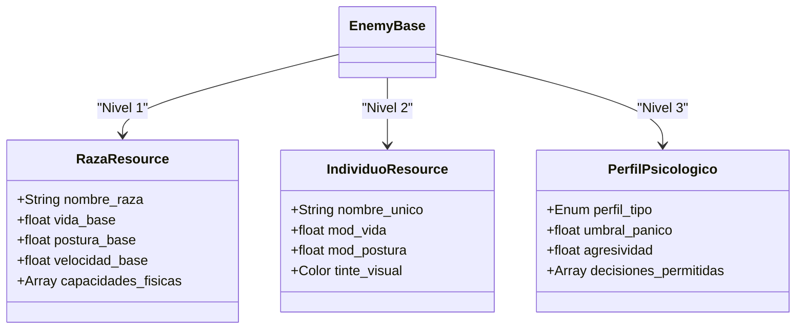

# GATETE-PROJECT 


**Juego de acción 2.5D / 3D estilizado — tierno, feroz y narrado desde la mente  
y los instintos de un gato negro adorable… pero letal.**

Motor: **Godot Engine 4.5.1**

---

## Visión General

**Gatete-Project** es un juego de combate donde el jugador controla a un gato negro  
ágil y letal que se abre paso entre enemigos usando velocidad, reflejos y puro  
instinto depredador.

La experiencia comienza en escenarios relativamente cotidianos: calles, patios,  
techos y rincones urbanos donde pequeños animales se convierten en rivales.

A medida que se avanza, el mundo empieza a cambiar sutilmente.

Los escenarios se vuelven más extraños.  
Las criaturas se comportan de formas inusuales.  
Algunos enemigos parecen… distintos.

---

## Identidad del Juego

### Estética

- Protagonista: **gato negro estilo cartoon**, adorable pero intimidante  
- Escenarios **3D con presentación 2.5D**  
- Ambientes nocturnos, urbanos y progresivamente más surrealistas  

### Tono

- Humor felino y comportamiento juguetón  
- Violencia estilizada, nunca realista  
- Narrativa ambiental **sugerida más que explicada**

---

## Mecánicas Principales

### Movimiento

- Caminar / Correr / Agacharse
- **Salto**
- **Sprint**
- **Dash** (toque corto de Shift)

### Combate

- Sistema de **combo básico 1-2-3** con escala de daño (LIGHT → MEDIUM → HEAVY)
- Golpe crítico probabilístico en el **tercer hit** del combo
- Fases de ataque: `startup / active / recovery`
- **Ruptura de postura enemiga** → estado POSTURE_BROKEN
- **Captura de enemigos** debilitados (hold botón derecho del mouse)
- **Ejecución tras captura exitosa**

### Sistema de Captura (Forcejeo)

Cuando el enemigo está en POSTURE_BROKEN:
- El jugador lo agarra manteniendo el botón derecho del mouse
- Ocurre un **duelo de barras**: CAPTURE_STAMINA del jugador vs. de la presa
- La presa forcejea activamente, drenando la stamina del jugador
- El jugador golpea a la presa con un **combo 1-2-3 exclusivo de captura**
- El golpe 3 es siempre crítico y remata si la presa está agotada
- Moverse durante el combo lo reinicia
- **Éxito** → recompensa de vida y corazones, enemigo muere
- **Fallo** → penalización de postura, vida, corazón y STUNNED
- **Cancelación voluntaria** → penalización menor

### Diagrama de la Ventana de Oportunidad (Caza y Ejecución)



---

### Sistema de "9 Vidas"

Las vidas representan la **suerte del gato**, no vidas tradicionales.

- Mientras quedan corazones: cada golpe consume 1 corazón y aplica solo el 15% del daño
- Sin corazones: el daño es real y casi letal
- Los corazones se recuperan mediante capturas exitosas

---

## DamageResolver del JUGADOR (Supervivencia y Mitigación)
Este diagrama es exclusivo para el Gatete. Implementa la Regla de Oro #8 (Time Stop), la #7 (Recuperación) y el Sistema de 9 Vidas (1.4 de la Biblia Definitiva).



---

## Arquitectura del Sistema de Combate

Todo el daño del juego fluye por un pipeline estricto e inalterable:
```
CombatMediator → SnapshotFactory → DamageResolver → apply(components) → EventBus
```

Los actores nunca se comunican directamente entre sí.  
Todo pasa por el **EventBus** como canal único de eventos.  
Los métodos directos como `take_damage()` están marcados como **deprecated**.

---

## Diagrama de Orquestación de Escena (Nodos y Componentes)



---

## Sistemas Implementados

### Bloque 0 — Fundación
- **EventBus** — canal global desacoplado de eventos
- **EntitySnapshot** — foto inmutable del estado de una entidad antes del daño
- **SnapshotFactory** — construye snapshots genéricamente para cualquier actor
- **DamageResolver** — única autoridad para calcular daño, críticos y 9 Vidas
- **CombatMediator** — orquestador del pipeline de combate

### Bloque 1 — Jugador
- Movimiento completo con stamina (caminar, correr, agacharse, saltar, dash)
- Sistema de combo 1-2-3 con fases startup/active/recovery
- Sistema de 9 Vidas con corazones
- Target Lock con cambio manual y automático al morir el objetivo
- UI completa: barras de vida, postura, corazones y stamina flotante

### Bloque 2 — Captura
- **CaptureResolver** — duelo de barras con forcejeo activo de la presa
- Combo de captura exclusivo (1-2-3), reinicio al moverse
- Parámetros configurables por enemigo: `capture_weight`, `capacidad_forcejeo`, `forcejeo_damage`
- UI de captura con barras de stamina para captor y presa
- Recompensas y penalizaciones según resultado

### Enemigos
- **EnemyBase** — arquitectura modular con componentes independientes
- **EnemyStateMachine** — estados: NORMAL, STUNNED, POSTURE_BROKEN, CAPTURED, DEAD
- IA básica: detección, persecución y ataque con cooldown
- Barras flotantes de vida y postura por enemigo

### Eventos canónicos implementados
`EVT_RECIBIR_GOLPE`, `EVT_POSTURA_ROTA`, `EVT_GOLPE_CRITICO_RECIBIDO`,
`EVT_ENEMIGO_MUERTO`, `EVT_GOLPE_FUERTE_RECIBIDO`, `EVT_CORAZON_PERDIDO`,
`EVT_INTENTO_CAPTURA`, `EVT_CAPTURA_EXITOSA`, `EVT_INTENTO_CAPTURA_FALLIDO`,
`EVT_LIBERACION_FORZADA`, `EVT_LIBERACION_FORZADA_CAPTOR`, `EVT_JUGADOR_CANCELA_CAZA`

---

## En Desarrollo — Bloque 3

- **EnemyMouse** — primer enemigo canónico con hitbox real y parámetros de ADN base
- Tipos de enemigo del MVP: estándar y mini-boss

## Pendiente (post-Bloque 3)

- **PsychologyComponent** — impulsos IRA y PÁNICO según eventos
- **ADN_Handler** — inyección de RazaResource + IndividuoResource + PerfilPsicologico
- **AIR_RECOVERY** y TIME STOP
- Parry y esquiva perfecta
- Sistema de recompensas escaladas por contexto de combate
- Animaciones y feedback visual (POSTURE_BROKEN, stun, ejecución)

## Diagrama de "ADN" (Estructura de Datos)
Su función es explicar cómo se construye un enemigo antes de que aparezca en pantalla. Evita que programar enemigos por separado y obliga a usar Resources.



---

## Estructura del Proyecto
```
autoload/
	EventBus.gd				← canal único de eventos (Autoload)
	catalogo.gd				← cargador de datos JSON

Systems/
	entity_snapshot.gd				← snapshot inmutable
	snapshot_factory.gd				← construye snapshots genéricamente
	damage_resolver.gd				← única autoridad del daño
	combat_mediator.gd				← orquestador del combate
	capture_resolver.gd				← cerebro del forcejeo
	capture_stamina_component.gd 	← componente compartido jugador/enemigo

Actors/
	Player/
		don_gatoController.gd
		Components/
			don_gatoCombat.gd
			don_gatoMovement_system.gd
			don_gatoHealth.gd
			don_gatoPosture.gd
			don_gatoLives.gd
			don_gatoStaminaComponent.gd
			don_gatoTargeting.gd
		StateMachine/
			don_gatoStateMachine.gd

	Enemies/
		EnemyBase/
			enemy_base.gd
			enemy_state_machine.gd
			Components/
				health_component.gd
				posture_component.gd
				stun_component.gd
				enemy_movement_component.gd
				enemy_combat_component.gd
				enemy_debug_component.gd

UI/
	PlayerUI/
		player_ui.gd
		player_stamina_bar.gd
	EnemyUI/
		floating_health_bar.gd
	CaptureUI/
		capture_ui.gd

World/
	Levels/mundo_3d.tscn
	Camera/camera_ring.gd

data/
	catalogo_datos.json
```

---

## Tecnologías

- **Motor**: Godot Engine 4.5.1
- **Lenguaje**: GDScript con tipado estático
- **Patrón**: Componente + Resolver + EventBus

---

## Sobre el Repositorio

Este repositorio funciona también como un espacio de **aprendizaje y exploración**  
dentro del desarrollo de videojuegos.

Si encuentras errores, comportamientos extraños o tienes alguna sugerencia,  
puedes abrir un **issue**.

---

## Licencia

Por definir según avance del proyecto.

---

## Nota del Autor

Gatete-Project es un proyecto personal en evolución.

Nació como una idea sencilla: explorar cómo se sentiría un juego de combate  
desde la perspectiva de un gato.

Y se convirtió en algo mucho más interesante.
